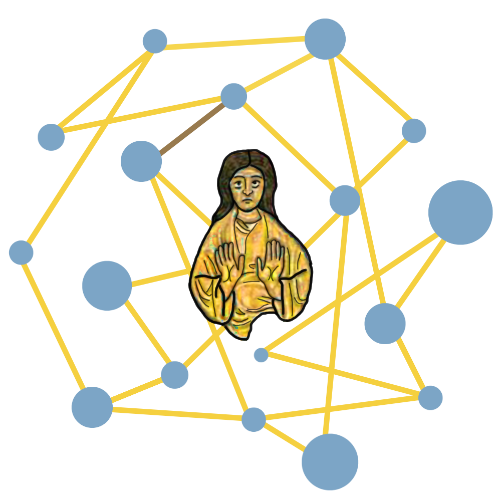
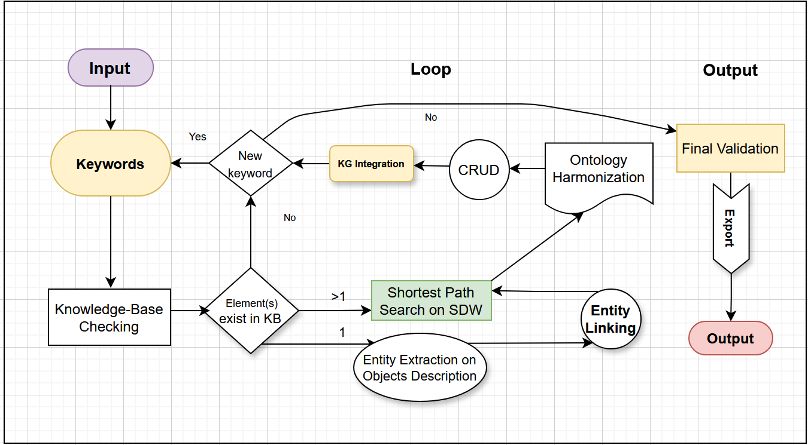
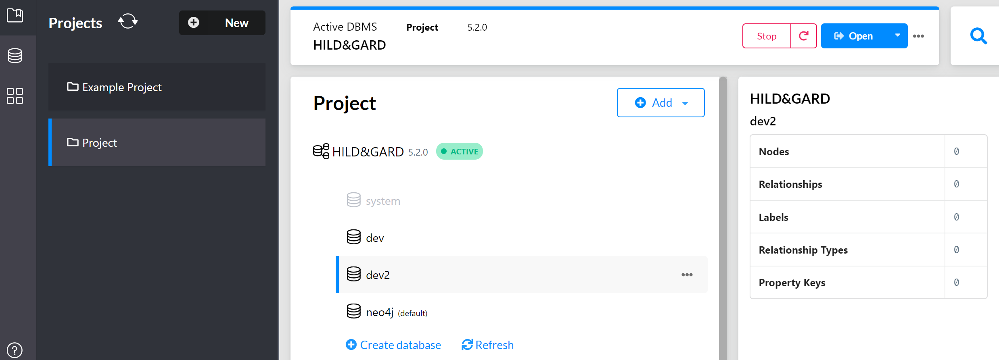
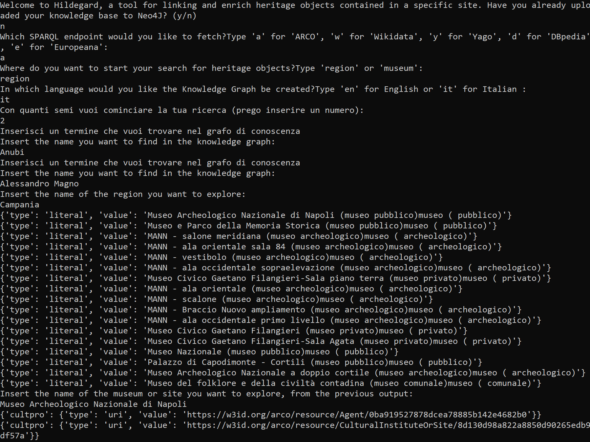
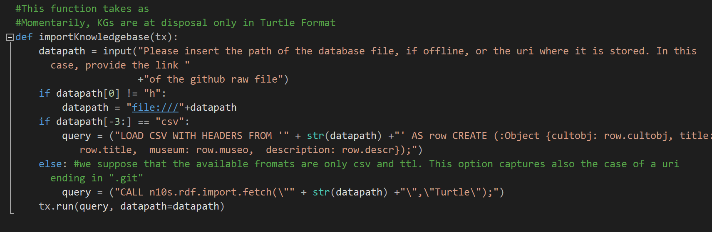
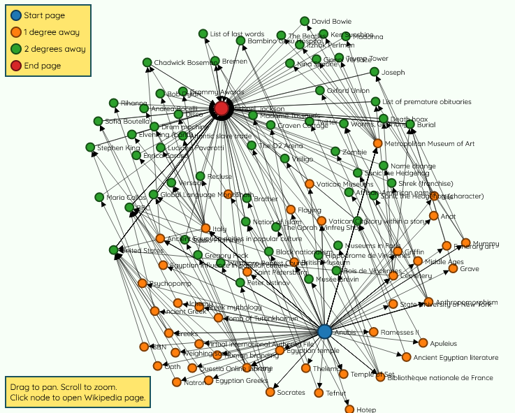
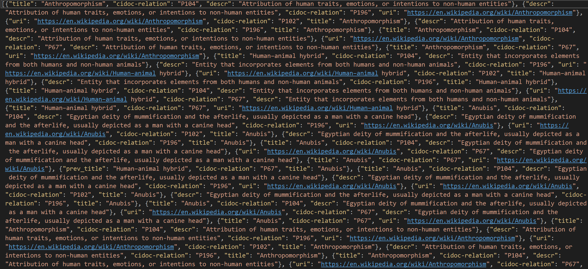
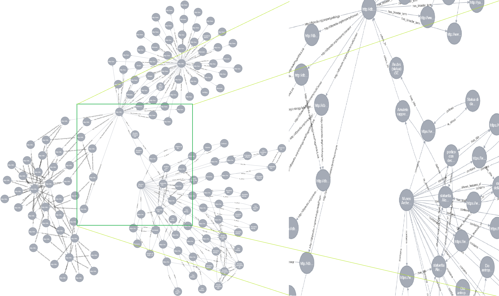

# HILDEGARD
_Human In the Loop Data Extraction &amp; Graphically Augmented Relation Discovery_

  

### Requirements

- Neo4j installed locally
- Python 3.7 or higher
- Selenium web-driver installed locally

HILDEGARD is an application conceived to guide a semi-expert user in the domain of cultural heritage data management toward the creation of a lightweight knowledge graph tailored for supporting Automatic Story Generation (ASG).
For this purpose, a subset of CIDOC-CRM classes and properties is preliminarily selected to fit the domain of interest. The input is constituted
by one or more seed-heritage objects selected from a knowledge base. In our case study, they are SPARQL-queried from a Linked
Open Database for Italian Cultural Heritage. The shortest path algorithm is then run online on all couplets obtained by a combination of
the Wikipedia entities from the selected entry-seeds descriptions. The retrieved entities are subsequently linked to their related DBpedia or
YAGO-entry in the chosen language, and the relationships among them are automatically retrieved. The proposed tool addresses different
knowledge gaps and societal needs simultaneously, such as the lack of solutions tailored for narrative purposes in the cultural heritage
domain, that is, to be used in a scenario where objects belonging to the same room must be linked through a narrative, which shall not only
be coherent and informative but also engaging and interesting. The prototype, already able to generate the triples required for the following
step of the proposed general ASG pipeline, is intended to be graphically enhanced so that the end user may guide the graph expansion
interactively.

  

After downloading the project, open the Hildegard project file.

Replace the Neo4J authentication credentials with the ones you have used to initialize the knowledge graph on your local:

driver = GraphDatabase.driver("bolt://localhost:7687",
                              auth=("neo4j","***"))

  

Then, run the project. You will be guided building the graph via a simple UI as in the following:

  

As you can notice, the prompts following the language selection are written in the selected language (in our case, Italian. Future versions of this application can also involve more languages). In the case study described in the article, the MANN museum of Naples has been selected.

The initial Knowledge Graph, in our case harvested from the ARCO dataset, will then be imported in Neo4J by running in back-end the following CIPHER query:

  

The core function of this application is the "Six-Degrees-of-Wikipedia" wrapper (sdow.py), which scrapes the relationships and entities placed as hops between the input entities directly from the homonym website.

  

After performing the Ontology Harmonization of the retrieved entities (defined by title, uri and description) with the CIDOC-CRM Ontology:

  

this is how the output JSON file looks like:

  

The final graph is supposed to include also DBpedia relationships:

  

A colab file presenting a light-weight version of this project can be found [here](https://github.com/Glottocrisio/HILDEGARD/blob/main/hildegard_lightweight.ipynb). There a CSV file is outputted.

If you use or reference this application, please cite the following article:

Palma, C. (2024). HILDEGARD: Human-in-the-Loop Data Extraction and Graphically Augmented Relation Discovery. Journal of Computational and Cognitive Engineering, Bon View Press. https://doi.org/10.47852/bonviewJCCE42022924

Saint Hildegard, pray for us Digital Humanists!

